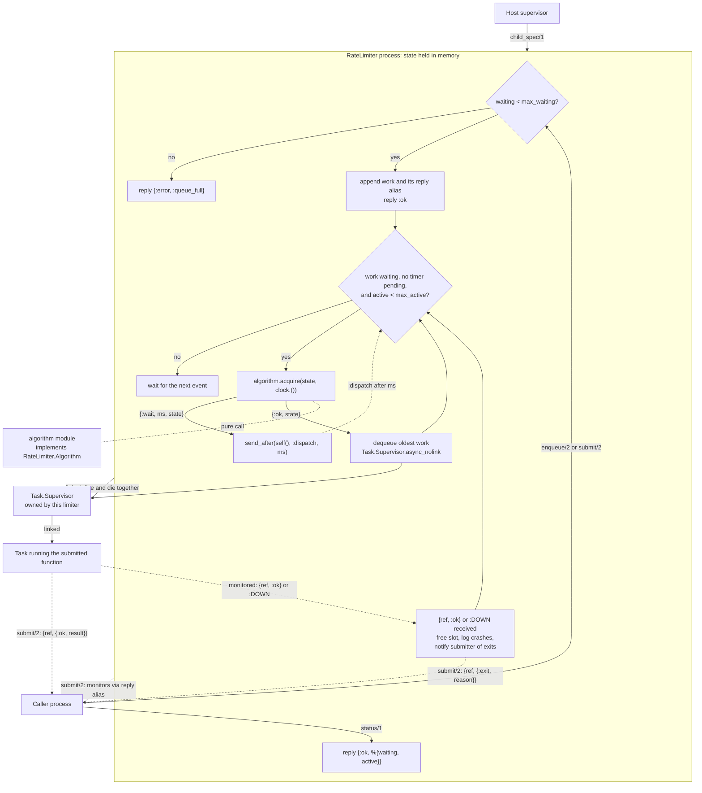

<p align="center">
    <a href="https://github.com/Fl4m3Ph03n1x/rate_limiter/releases/tag/v2.0.0">
        
    </a>
</p>

# RateLimiter

RateLimiter runs submitted work at a bounded rate inside an Elixir application.
Each limiter is a supervised process that admits work into a bounded FIFO
queue, starts it at a pace decided by a pluggable algorithm, caps how much runs
at once, and isolates failures in supervised tasks.

## Strengths and Weaknesses

### Strengths

- **Bounded admission.** `max_waiting` caps the queue. A full queue rejects new
  work at once with `{:error, :queue_full}`: it never blocks the caller or
  drops work it has already accepted.
- **Every start is authorized.** The limiter asks the algorithm before each
  start and never starts work it refuses. While waiting it holds one timer for
  the reported delay, so it never polls.
- **Separate concurrency cap.** `max_active` limits how many tasks run at once,
  independently of the start rate. This matters for APIs that also limit
  concurrent connections.
- **Failure isolation.** Work runs in tasks that the limiter monitors but is not
  linked to. A crashing task is logged and frees its slot; the limiter and its
  queue survive. Work submitted with `submit/2` reports every crash to its
  caller as `{:exit, reason}`.
- **Results without leftovers.** `submit/2` results go straight from the task
  to the caller and are copied once. A reply that arrives after an `await/2`
  timeout or `forget/1` is dropped rather than left in the mailbox.
- **Clean restarts.** Each limiter links its own `Task.Supervisor`, so a
  restarted limiter never inherits in-flight tasks from its previous
  incarnation.
- **Many independent limiters.** The child id includes `:name`, so one
  supervisor can run several limiters with different settings as siblings.
- **Pluggable, pure pacing.** Algorithms implement `RateLimiter.Algorithm` as
  pure functions of their state and the current time. This makes them easy to
  replace and to test deterministically.
- **Fails fast.** Invalid options stop the limiter from starting, rather than
  surfacing on the first request.

### Weaknesses

- **The queue is in memory only.** A limiter crash or restart loses every
  waiting task. `submit/2` callers learn of it as `{:error, :not_running}`;
  `enqueue/2` callers are not notified. A reply racing the limiter's stop can be
  lost even though the work ran. There is no persistence or replay.
- **Accepted work cannot be cancelled.** Once admitted, work runs unless the
  limiter stops, even after an `await/2` timeout, `forget/1`, or its caller's
  death. Only the reply is dropped.
- **Awaiting your own limiter can block.** A task that submits to its own
  limiter and awaits the reply keeps its slot while it waits. When every slot is
  busy, the inner work cannot start and the await times out.
- **One process per limiter.** Every `enqueue/2`, `submit/2`, and `status/1` is
  a `GenServer.call` to that process. Only `:noproc` and shutdown exits become
  `{:error, :not_running}`; a call timeout under heavy load still exits the
  caller.
- **Algorithms see only time.** An algorithm cannot weigh work by cost, look
  at the queue, or slow down after an upstream `429`.
- **Pacing counts starts, not arrivals.** Network jitter can still bunch
  requests together before they reach the server.
- **Per node, not shared.** Each limiter enforces its own budget. Two nodes, or
  two limiters for the same API, can together exceed the upstream limit.

## Configuration and Usage

### Installation

Add the package as a Git dependency, pinned to a release tag. The package starts
no processes of its own; the host application supervises every limiter.

```elixir
def deps do
  [
    {:rate_limiter, github: "Fl4m3Ph03n1x/rate_limiter", tag: "v2.0.0"}
  ]
end
```

It requires Elixir `~> 1.20` and has been validated on Erlang/OTP 28.

### Options

The limiter validates its own options. It then passes the full option list to
the algorithm's `init/1`, so algorithm settings go in the same list.

| Option | Required by | Value |
| --- | --- | --- |
| `:name` | `RateLimiter` | Registered atom. Also forms the child id `{RateLimiter, name}`. |
| `:algorithm` | `RateLimiter` | Module implementing `RateLimiter.Algorithm`. There is no default. |
| `:max_waiting` | `RateLimiter` | Positive integer: work allowed to wait in the queue. |
| `:max_active` | `RateLimiter` | Positive integer: tasks allowed to run at once. |

Every other option belongs to the chosen algorithm, which documents its own.
The examples below use `RateLimiter.LeakyBucket`, which requires
`:requests_per_second`.

`:clock` and `:send_after` also exist so tests can control time. Production
code should leave them unset.

A missing `:name` raises `KeyError` in the caller. Any other missing or invalid
option makes the limiter process exit during startup. A supervisor then reports
`{:error, {exception, stacktrace}}` and the limiter never starts.

### Starting limiters

Add each limiter to the host's supervision tree. Two limiters with different
names run side by side:

```elixir
children = [
  {RateLimiter,
   name: MyApp.SearchApiLimiter,
   algorithm: RateLimiter.LeakyBucket,
   requests_per_second: 3,
   max_waiting: 500,
   max_active: 12},
  {RateLimiter,
   name: MyApp.ReportApiLimiter,
   algorithm: RateLimiter.LeakyBucket,
   requests_per_second: 1,
   max_waiting: 50,
   max_active: 1}
]

Supervisor.start_link(children, strategy: :one_for_one)
```

### Submitting work

There are two entry points. Both take a zero-arity function and return once the
work is admitted:

- `enqueue/2` sends no reply. Use it when you do not need the outcome.
- `submit/2` returns `{:ok, ref}` and later sends the outcome to the caller; see
  [Receiving a result](#receiving-a-result).

Both reject work the same way:

```elixir
case RateLimiter.enqueue(MyApp.SearchApiLimiter, fn -> refresh_cache() end) do
  :ok -> :accepted
  {:error, :queue_full} -> :try_later
  {:error, :not_running} -> :limiter_down
end
```

### Receiving a result

`submit/2` returns a reference. Pass it to `await/2` to wait for the reply:

```elixir
with {:ok, ref} <- RateLimiter.submit(MyApp.SearchApiLimiter, fn -> search("elixir") end) do
  RateLimiter.await(ref, 10_000)
end
```

`await/2` returns one of:

| Return | Meaning |
| --- | --- |
| `{:ok, result}` | The function returned `result`. |
| `{:exit, reason}` | The function raised, threw, or exited. |
| `{:error, :not_running}` | The limiter stopped before the work finished. |
| `{:error, :timeout}` | No reply in time. The work still runs; its reply is dropped. |

`await/2` blocks, so a GenServer should match the reply in `handle_info/2`
instead. The messages are `{ref, {:ok, result}}`, `{ref, {:exit, reason}}`, and
`{:DOWN, ref, :process, pid, reason}` when the limiter stops first:

```elixir
def handle_cast({:search, query}, state) do
  {:ok, ref} = RateLimiter.submit(MyApp.SearchApiLimiter, fn -> search(query) end)
  {:noreply, put_in(state.pending[ref], query)}
end

def handle_info({ref, reply}, state) when is_map_key(state.pending, ref) do
  {query, pending} = Map.pop(state.pending, ref)
  {:noreply, %{state | pending: pending, replies: Map.put(state.replies, query, reply)}}
end

def handle_info({:DOWN, ref, :process, _pid, _reason}, state)
    when is_map_key(state.pending, ref) do
  {:noreply, %{state | pending: Map.delete(state.pending, ref)}}
end
```

Call `RateLimiter.forget(ref)` to give up on a reply. It is dropped, even if it
has already arrived, but the work still runs.

A reference can be awaited once, and only by the process that called
`submit/2`.

### Inspecting a limiter

`status/1` reports how much work is waiting and how much is running:

```elixir
{:ok, %{waiting: 4, active: 2}} = RateLimiter.status(MyApp.SearchApiLimiter)
```

### Writing an algorithm

An algorithm is a pure module: no processes, timers, or clock reads.
`acquire/2` must return `{:ok, state}` rather than a zero-millisecond wait, and
must not authorize two starts for the same `now`. This one keeps a fixed gap,
in milliseconds, between starts:

```elixir
defmodule MyApp.MinimumGap do
  @behaviour RateLimiter.Algorithm

  @impl RateLimiter.Algorithm
  def init(opts), do: %{gap: Keyword.fetch!(opts, :gap_ms), last_start_at: nil}

  @impl RateLimiter.Algorithm
  def acquire(%{last_start_at: nil} = state, now), do: {:ok, %{state | last_start_at: now}}

  def acquire(%{gap: gap, last_start_at: last_start_at} = state, now) do
    case last_start_at + gap - now do
      remaining when remaining > 0 -> {:wait, remaining, state}
      _ready -> {:ok, %{state | last_start_at: now}}
    end
  end
end

{RateLimiter,
 name: MyApp.SlowApiLimiter,
 algorithm: MyApp.MinimumGap,
 gap_ms: 2_000,
 max_waiting: 20,
 max_active: 1}
```

### Development

Run these commands from the repository root:

```bash
mix deps.get
mix format --check-formatted
mix compile --warnings-as-errors
mix test
mix credo --strict
mix dialyzer
mix docs
git diff --check
```

The tests never sleep to wait for pacing. They block tasks until the test
releases them, and they replace the clock and timer for time-dependent cases.

## Architecture

| Module | Responsibility |
| --- | --- |
| `RateLimiter` | The limiter process: admission, the FIFO queue, dispatch, the concurrency cap, task monitoring, and reply delivery for `submit/2`. |
| `RateLimiter.Algorithm` | Behaviour for pure pacing decisions: `init/1` and `acquire/2`. |
| Algorithm modules | Pacing policies implementing `RateLimiter.Algorithm`, for example `RateLimiter.LeakyBucket`. Each limiter names its own; there is no default. |

The limiter tries to start work after every accepted `enqueue/2` or `submit/2`,
every finished task, and every timer message. It starts work only when
something is waiting, no timer is pending, a slot is free, and the algorithm
allows it.



